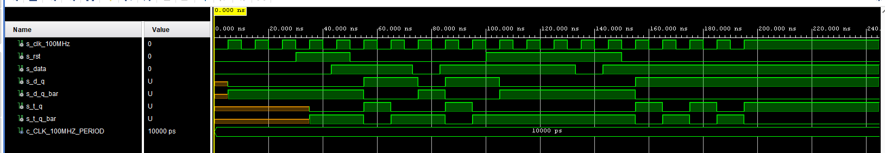

# Lab 5: Martin Tavoda

### D & T Flip-flops

1. Screenshot with simulated time waveforms. Try to simulate both D- and T-type flip-flops in a single testbench with a maximum duration of 200 ns, including reset. Always display all inputs and outputs (display the inputs at the top of the image, the outputs below them) at the appropriate time scale!

   

### JK Flip-flop

1. Listing of VHDL architecture for JK-type flip-flop. Always use syntax highlighting, meaningful comments, and follow VHDL guidelines:

```vhdl
architecture behavioral of t_ff_rst is
    -- It must use this local signal instead of output ports
    -- because "out" ports cannot be read within the architecture
    signal sig_q : std_logic;
begin
    --------------------------------------------------------
    -- p_t_ff_rst:
    -- T type flip-flop with a high-active synchro reset and
    -- rising-edge clk.
    -- sig_q = t./sig_q + /t.sig_q
    -- sig_q =  sig_q if t = 0 (no change)
    -- sig_q = /sig_q if t = 1 (inversion)
    --------------------------------------------------------
    p_t_ff_rst : process (clk) is
    begin
        if rising_edge(clk) then

        if (rst = '1') then
                sig_q     <= '0';
            else
                if (t = '0') then
                    sig_q <= sig_q;
                else 
                    sig_q <= not sig_q;
                end if;
            end if;            
        end if;
    end process p_t_ff_rst;

    -- Output ports are permanently connected to local signal
    q     <= sig_q;
    q_bar <= not sig_q;
end architecture behavioral;
```

### Shift register

1. Image of the shift register `top` level schematic. The image can be drawn on a computer or by hand. Always name all inputs, outputs, components and internal signals!

   